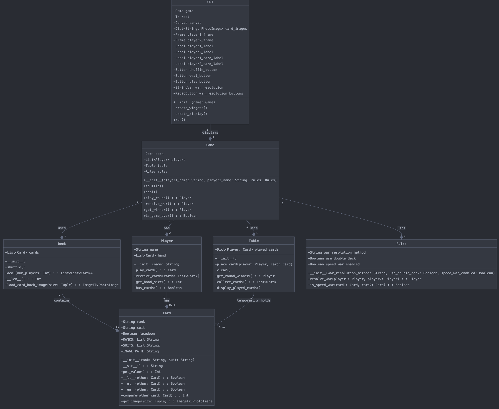

# Warzone: The Battle of Cards

A Python implementation of the classic card game "War" with a graphical user interface.




## Requirements

- Python 3.8+
- Tkinter (usually comes pre-installed with Python)
- Pillow (PIL Fork) for image processing

## Setup

1. Clone the repository:

   ```
   git clone https://github.com/yourusername/warzone-battle-of-cards.git
   cd warzone-battle-of-cards
   ```

2. Create a virtual environment (optional but recommended):

   ```
   python -m venv venv
   source venv/bin/activate  # On Windows, use `venv\Scripts\activate`
   ```

3. Install the required packages:
   ```
   pip install -r requirements.txt
   ```

## Running the Game

From the project root directory, run:

```
python run.py
```

## Running Tests

To run the unit tests, execute:

```
python -m unittest discover tests
```

## Project Structure

- `src/`: Contains the main source code for the game.
- `static/`: Holds static assets like card images.
- `tests/`: Contains unit tests for each class.

## Game Rules

[Include a brief overview of the game rules here]

## Contributing

[Include guidelines for contributing to the project]

## License

[Specify the license under which the project is released]
